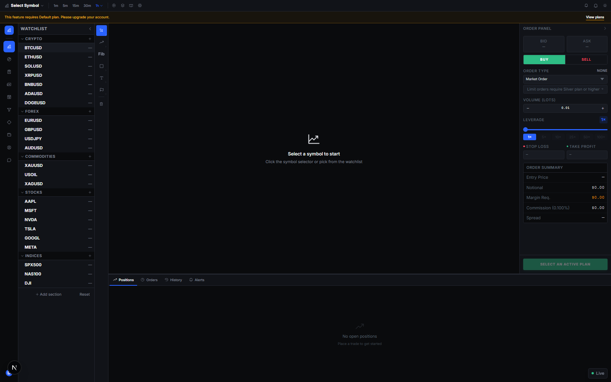

# NovaTrade

TradingView-style public-beta paper-trading platform with three independent applications sharing
PostgreSQL. This is not a configured monorepo: each app has its own dependencies, scripts and environment.

| Landing | Trading terminal |
|---|---|
|  |  |

## Applications

| Directory | Stack | Default port | Purpose |
|---|---|---:|---|
| `backend/` | NestJS 11, Prisma, Socket.IO | 3001 | auth, market data, trading, wallet, KYC, support |
| `frontend/` | Next.js 15, React 19 | 3000 | user trading terminal |
| `admin/` | Next.js 15, React 18, Prisma | 3002 | privileged operations and audit trail |

The apps share one PostgreSQL database but use separate auth secrets. Never reuse the user JWT secret
for admin auth.

## Paper execution model

- Market BUY fills at the fresh provider ask; Market SELL fills at the fresh provider bid.
- Limit orders reserve margin once when accepted, charge commission only when filled and release the
  reservation when cancelled. Pending orders count against the plan position limit.
- Quantity is base-asset exposure. Leverage reduces required margin; it does not multiply price P&L.
- Open and close commissions are charged once each at the active plan rate. Missing or stale provider
  prices fail closed. There is no broker execution or real-money settlement in this repository.

## Provider and entitlement contracts

- REST assets/prices/candles and Socket.IO snapshots require a valid user JWT and current plan entitlement.
  The runtime catalog is fail-closed unless active database/provider coverage matches the advertised
  Default/Silver/Gold/Platinum counts `7/20/32/42`.
- Official Economic Releases aggregates the public [Eurostat iCalendar](https://ec.europa.eu/eurostat/subscribe/ics.format)
  and [U.S. Bureau of Economic Analysis release schedule](https://www.bea.gov/news/schedule). Neither source
  requires an API key. The backend refreshes both independently every 30 minutes, accepts a fresh partial result
  if one source is down and never serves an expired or generated fallback.
- These official schedules provide release dates and titles, not market consensus, previous or actual values.
  The UI states that limitation and does not fabricate empty data columns. Event/source attribution links are
  included in every response; the frontend polls only the backend cache once per minute.

## Local setup

1. Create local env files from the checked-in `.env.example` files. Never copy production values.
2. Start PostgreSQL and apply the appropriate Prisma migrations/generation for backend and admin.
3. Install and run each app in its own terminal:

```bash
cd backend
npm install
npm run start:dev

cd ../frontend
npm install
npm run dev

cd ../admin
npm install
npm run dev
```

## Verification

```bash
curl http://localhost:3001/health/live
curl http://localhost:3001/health/ready
curl http://localhost:3000/api/health
curl http://localhost:3002/api/health

cd backend
npm test
npm run build

cd ../frontend
npm run build

cd ../admin
npm run check:parity
npm run build
```

Operational scripts and release controls are documented in
[`docs/production-readiness.md`](docs/production-readiness.md). For local recovery use
`ops/start-local-stack.ps1`; it opens PostgreSQL, backend, frontend and admin in separate visible CMD
windows. Use `ops/stop-local-stack.ps1` for a complete process-tree and local database stop, and
`ops/check-health.ps1` for probes. Database backup, verify and guarded restore scripts are under `ops/`.

Current architecture and known risks are mapped in
`../../Obsidian/Workbench/Code/NovaTrade-Code-Map.md`. This nested repo contains active dirty work;
verify `git status` before edits. Production deployment and credential rotation require Roman's
approval.
